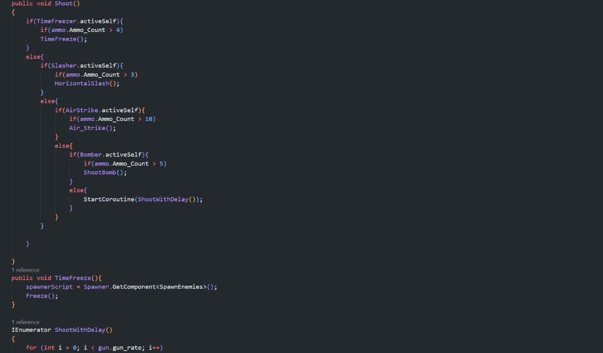
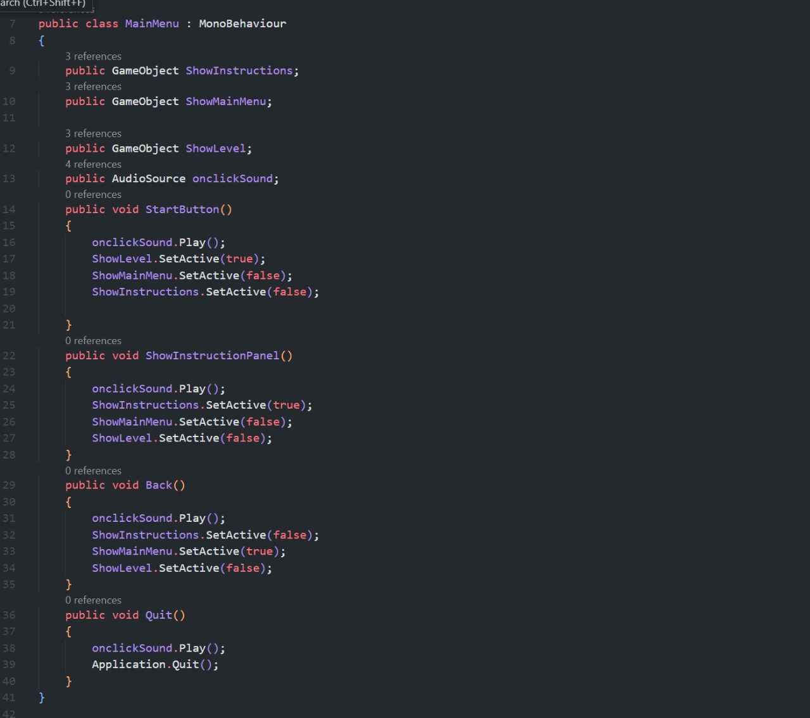
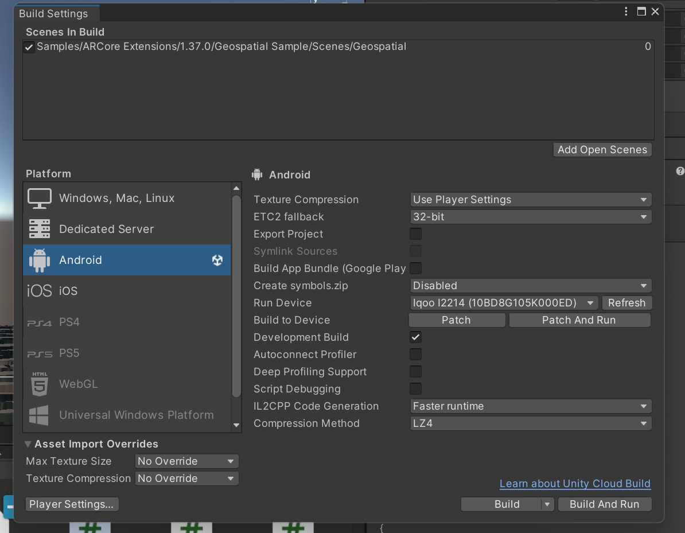

# Kshatriyas_Takneek_GeoMatrix
## Android Invansion

- [Setting up a unity project](#1)
- [Setting up basic game objects](#2)
- [Starting with basic scripting](#3)
- [Setting up UI](#4)
- [Adding game art and icons](#5)
- [Building the final apk file](#6)

--------------------

#### Setting up a Unity project
(Disclaimer - We did this on Unity Version 2021.3.17f)

- Set up a 3D project with built-in-renderer pipeline.
- Set up Geospatial AR environment
  - You can use the following youtube video for reference
  - https://youtu.be/tnBFi_EWaCE?si=EmOfjDCa_nRTmWrF

--------------------

#### Setting up Basic Game Objects

- Set up basic objects such as spheres, cubes, cylinders to be used as dummy objects for enemy, sphere, etc.
- We are doing this in order to help us with creating a basic blue print for the game.

--------------------

#### Starting with basic scripting

- Set up basic scripts such as shooting, enemy despawning, enemy spawning, etc.
- 
- Add these scripts to the respective dummy objects.

--------------------

#### Setting up UI

- Set up basic functionalities such as pause menu, start button, instruction screeen etc.
- 
- Also make sure to add crosshair shoot button etc.

--------------------

#### Adding game art and Icons

- Add respective game art to their placeholders for better visuals.
- Add icons for shooting and switching weapons.

--------------------

#### Building an apk file

- To install the game you would need to build an apk file.
- 
- Install the game using the apk file to play the game on your mobile phone
